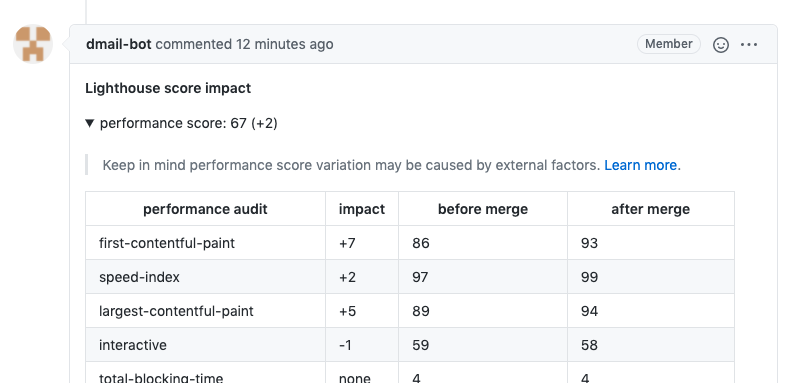

# lighthouse-score-merge-impact

Get pull request merge impact on lighthouse score

# Table of contents

- [Presentation](#Presentation)
- [Usage in github workflow](#Usage-in-github-workflow)
- [Usage outside github workflow](#Usage-outside-github-workflow)

## Presentation

`@jsenv/lighthouse-score-merge-impact` analyses a pull request impact on lighthouse score. This analysis is posted in a comment of the pull request.

The screenshot below shows that comment posted in a pull request.

The comment can be expanded to get more details.

# Usage in github workflow

TODO

# Usage outside github workflow

TODO
