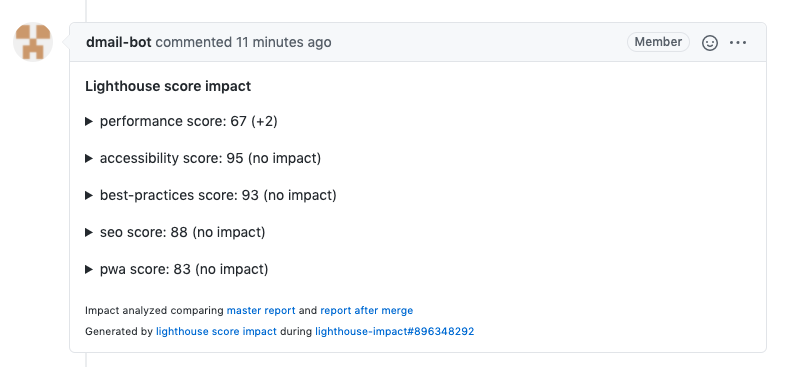

# lighthouse-score-impact

Add lighthouse score impact into GitHub pull requests.

[](https://github.com/jsenv/jsenv-lighthouse-score-impact/packages)
[](https://www.npmjs.com/package/@jsenv/lighthouse-score-impact)
[](https://github.com/jsenv/jsenv-lighthouse-score-impact/actions?workflow=ci)
[](https://codecov.io/gh/jsenv/jsenv-lighthouse-score-impact)

# Table of contents

- [Presentation](#Presentation)
- [Installation](#Installation)
- [Lighthouse report viewer](#Lighthouse-report-viewer)
- [How it works](#How-it-works)

# Presentation

`@jsenv/lighthouse-score-impact` analyses a pull request impact on lighthouse score. This analysis is posted in a comment of the pull request.

The screenshot below shows that comment posted in a pull request.



The comment can be expanded to get more details.


# Installation

This section explains how integrate lighthouse score impact to pull requests on GitHub. To configure a GitHub workflow, see [Configuring a GitHub workflow](#Configuring-a-GitHub-workflow), otherwise see [Configuring a workflow](#Configuring-a-workflow). If you don't know what to choose, prefer a GitHub workflow as it's a bit easier to configure.

# Configuring a GitHub workflow

<details>
  <summary>1. <code>@jsenv/lighthouse-score-impact</code> in devDependencies </summary>

```console
npm install --save-dev @jsenv/lighthouse-score-impact
```

</details>

<details>
  <summary>2. Create a file generating a lighthouse report</summary>

You need to create a file that will generate a lighthouse report. This file will use `generateLighthouseReport` function exported by `@jsenv/lighthouse-score-impact` to do so. The file below is an example producing a lighthouse report for a basic html page served locally. In order to get the lighthouse report of your website, adapt the code to your own logic.

`generate-lighthouse-report.js`

```js
import { createServer } from "http"
import { generateLighthouseReport } from "@jsenv/lighthouse-score-impact"

const server = createServer((request, response) => {
  response.writeHead(200, {
    "content-type": "text/html",
  })
  response.end(`<!DOCTYPE html>
<html>
  <head>
    <title>Title</title>
    <meta charset="utf-8" />
    <link rel="icon" href="data:," />
  </head>
  <body>
    Hello, World!
  </body>
</html>`)
})
server.listen(8080)

generateLighthouseReport("http://127.0.0.1:8080", {
  projectDirectoryUrl: new URL("./", import.meta.url),
  jsonFileRelativeUrl: "./lighthouse/report.json",
})
```

</details>

<details>
  <summary>3. A script file runned by the workflow</summary>

This file will be called by the workflow: it generates lighthouse report before and after merging a pull request and post a comment in the pull request. Read more in [How it works](#How-it-works).

`.github/workflows/report-lighthouse-impact.js`

```js
import { reportLighthouseScoreImpact, readGithubWorkflowEnv } from "@jsenv/lighthouse-score-impact"

reportLighthouseScoreImpact({
  ...readGithubWorkflowEnv(),
  jsonFileGenerateCommand: "node ./generate-lighthouse-report.js",
  jsonFileRelativeUrl: "./lighthouse-report.json",
})
```

</details>

<details>
  <summary>4. Create a workflow.yml file</summary>

`.github/workflows/lighthouse-impact.yml`

```yml
name: lighthouse-impact

on: pull_request_target

jobs:
  lighthouse-impact:
    strategy:
      matrix:
        os: [ubuntu-latest]
        node: [14.5.0]
    runs-on: ${{ matrix.os }}
    name: lighthouse impact
    steps:
        uses: actions/checkout@v2
        uses: actions/setup-node@v1
        with:
          node-version: ${{ matrix.node }}
        run: npm install
      - name: Report lighthouse impact
        run: node ./report-lighthouse-impact.js
        env:
          GITHUB_TOKEN: ${{ secrets.GITHUB_TOKEN }}
```

</details>

# Configuring a workflow

<details>
  <summary>1. <code>@jsenv/lighthouse-score-impact</code> in devDependencies </summary>

```console
npm install --save-dev @jsenv/lighthouse-score-impact
```

</details>

<details>
  <summary>2. Create a file generating a lighthouse report</summary>

You need to create a file that will generate a lighthouse report. This file will use `generateLighthouseReport` function exported by `@jsenv/lighthouse-score-impact` to do so. The file below is an example producing a lighthouse report for a basic html page served locally. In order to get the lighthouse report of your website, adapt the code to your own logic.

`generate-lighthouse-report.js`

```js
import { createServer } from "http"
import { generateLighthouseReport } from "@jsenv/lighthouse-score-impact"

const server = createServer((request, response) => {
  response.writeHead(200, {
    "content-type": "text/html",
  })
  response.end(`<!DOCTYPE html>
<html>
  <head>
    <title>Title</title>
    <meta charset="utf-8" />
    <link rel="icon" href="data:," />
  </head>
  <body>
    Hello, World!
  </body>
</html>`)
})
server.listen(8080)

generateLighthouseReport("http://127.0.0.1:8080", {
  projectDirectoryUrl: new URL("./", import.meta.url),
  jsonFileRelativeUrl: "./lighthouse/report.json",
})
```

</details>

<details>
  <summary>3. A script file runned by the workflow</summary>

This file will be called by the workflow: it generates lighthouse report before and after merging a pull request and post a comment in the pull request. Read more in [How it works](#How-it-works).

When outside a GitHub workflow you must provide `{ projectDirectoryUrl, githubToken, repositoryOwner, repositoryName, pullRequestNumber }` "manually" to `reportLighthouseScoreImpact`.

The code below is an examle for Travis.

`.github/workflows/report-lighthouse-impact.js`

```js
import { reportLighthouseScoreImpact, readGithubWorkflowEnv } from "@jsenv/lighthouse-score-impact"

reportLighthouseScoreImpact({
  projectDirectoryUrl: process.env.TRAVIS_BUILD_DIR,
  githubToken: process.env.GITHUB_TOKEN, // make it available somehow
  repositoryOwner: process.env.TRAVIS_REPO_SLUG.split("/")[0],
  repositoryName: process.env.TRAVIS_REPO_SLUG.split("/")[1],
  pullRequestNumber: process.env.TRAVIS_PULL_REQUEST,

  jsonFileGenerateCommand: "node ./generate-lighthouse-report.js",
  jsonFileRelativeUrl: "./lighthouse-report.json",
})
```

</details>

<details>
  <summary>4. Create a GitHub token</summary>

In order to have `process.env.GITHUB_TOKEN` you need to create a GitHub token with `repo` scope at https://github.com/settings/tokens/new. After that you need to setup this environment variable. The exact way to do this is specific to your project and tools. Applied to Travis you could add it to your environment variables as documented in https://docs.travis-ci.com/user/environment-variables/#defining-variables-in-repository-settings.

</details>

<details>
  <summary>5. Create your workflow file (depends the workflow you use)</summary>

`reportFileSizeImpact` must be called in a state where your git repository has been cloned and you are currently on the pull request branch. Inside github workflow this is done by the following lines in `file-size-impact.yml`.

```yml
uses: actions/checkout@v2
uses: actions/setup-node@v1
with:
  node-version: ${{ matrix.node }}
run: npm install
```

In your CI you must replicate this, the corresponding commands looks as below:

```console
git init
git remote add origin $GITHUB_REPOSITORY_URL
git fetch --no-tags --prune origin $PULL_REQUEST_HEAD_REF
git checkout origin/$PULL_REQUEST_HEAD_REF
npm install
node ./report-size-impact.js
```

</details>

# Lighthouse report viewer

The pull request comment can contain links to see lighthouse reports in [Lighthouse Report Viewer](https://googlechrome.github.io/lighthouse/viewer).

To unlock this you need a GitHub token with the right to create gists. Every github workflow has access to a magic token `secrets.GITHUB_TOKEN`. But this token is not allowed to create gists. We need to update the worflow file like [lighthouse-score-impact.yml#L26](./.github/workflows/lighthouse-score-impact.yml#L26) to use an other token that will have the rights to create gists.

```diff
- GITHUB_TOKEN: ${{ secrets.GITHUB_TOKEN }}
+ GITHUB_TOKEN: ${{ secrets.LIGHTHOUSE_GITHUB_TOKEN }}
```

You can generate a new token at https://github.com/settings/tokens/new. That token needs `repo` and `gists` scope. Copy this token and add it to your repository secrets at https://github.com/REPOSITORY_OWNER/REPOSITORY_NAME/settings/secrets/new. For this example the secret is named `LIGHTHOUSE_GITHUB_TOKEN`.

# How it works

In order to analyse the impact of a pull request on lighthouse score this project does the following:

1. Checkout pull request base branch
2. Generates a lighthouse report
3. Merge pull request into its base
4. Generates a second lighthouse report.
5. Analyse differences between the two lighthouse reports
6. Post or update comment in the pull request
